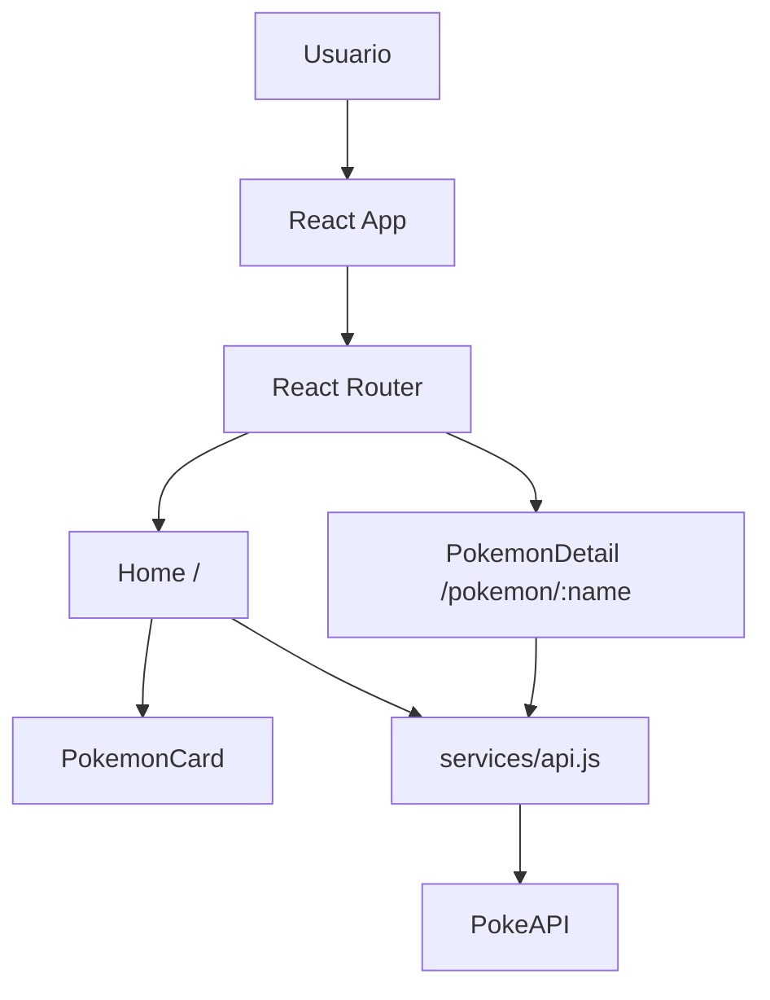
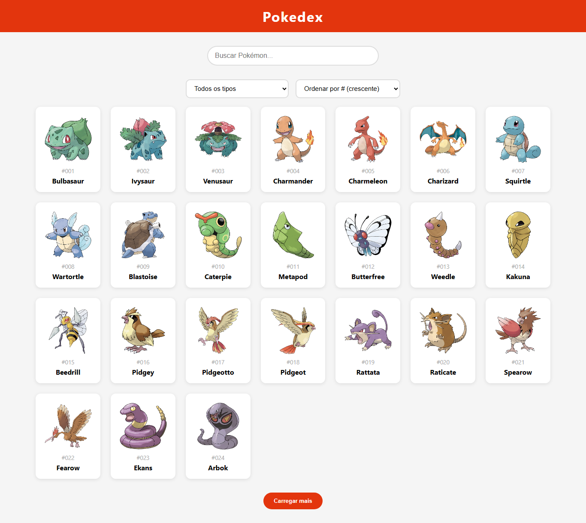
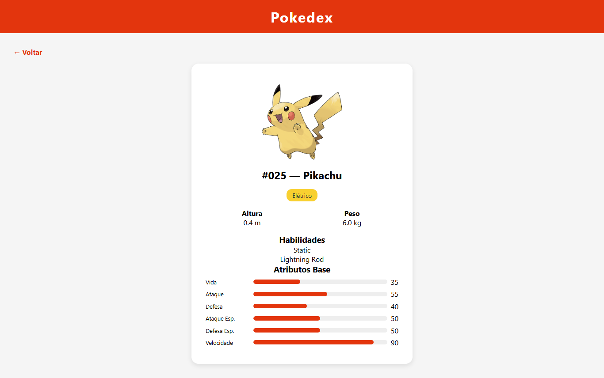

# Pokedex React

Projeto feito para a disciplina, com foco em React e consumo de API.

Aluno: Luis Fernando Barbosa Filho 
Ano: 2026

## Link da aplicacao online

https://LuisBarbosaa.github.io/pokedex/

## Repositorio (codigo-fonte versionado)

https://github.com/LuisBarbosaa/pokedex

## Sobre o projeto

Esse projeto e uma Pokedex que consome dados reais da PokeAPI.
Na tela principal da para:

- listar os 151 Pokemon da Geracao I
- pesquisar Pokemon por nome
- filtrar por tipo
- ordenar por numero ou nome

Ao clicar no card de um Pokemon, abre a pagina de detalhes com:

- tipos
- altura e peso
- habilidades
- atributos base

## Tecnologias usadas

| Tecnologia | Versao | Uso no projeto |
| --- | --- | --- |
| React | 18.x | interface da aplicacao |
| Vite | 8.x | ambiente de desenvolvimento e build |
| React Router DOM | 6.x | rotas e navegacao interna |
| Axios | 1.x | requisicoes HTTP |
| PokeAPI | publica | dados dos Pokemon |
| GitHub Pages | - | deploy online |

## Como rodar localmente

Pre-requisito: Node.js 18+ e npm.

```bash
# clonar repositorio
git clone https://github.com/LuisBarbosaa/pokedex.git

# entrar na pasta
cd pokedex

# instalar dependencias
npm install

# iniciar em modo desenvolvimento
npm run dev
```

Abrir no navegador:

http://127.0.0.1:5173/pokedex/

Comandos uteis:

```bash
npm run build    # build de producao
npm run preview  # visualizar build
npm run lint     # verificar padrao de codigo
npm run deploy   # publicar no GitHub Pages
```

## API utilizada

PokeAPI: https://pokeapi.co/

Endpoints usados no projeto:

- `GET https://pokeapi.co/api/v2/pokemon?limit=151&offset=0`
- `GET https://pokeapi.co/api/v2/pokemon/{nameOrId}`
- `GET https://pokeapi.co/api/v2/type`
- `GET https://pokeapi.co/api/v2/type/{typeName}`

## Rotas dinamicas e links internos

Rotas:

- `/` -> Home (listagem)
- `/pokemon/:name` -> Detalhes do Pokemon

Links internos:

- cada card na Home leva para `/pokemon/:name`
- na tela de detalhes tem botao/link para voltar para Home

## Arquitetura da aplicacao



Estrutura principal de pastas:

```txt
src/
  components/
    Header.jsx
    Loading.jsx
    PokemonCard.jsx
  pages/
    Home.jsx
    PokemonDetail.jsx
  services/
    api.js
  App.jsx
  main.jsx
```

## Prints da aplicacao

### Tela Home



### Tela de detalhes


